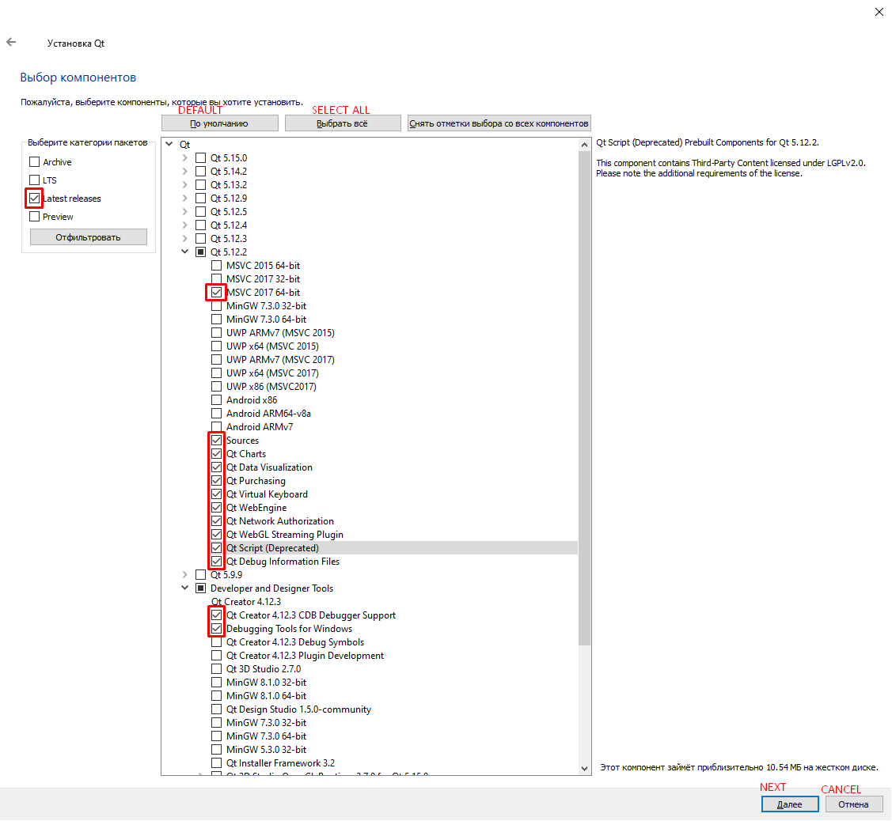

#### RU: Это инструкция для создание статической линковки(сборки) для QT 5.9 - 5.15, с помощью данной инструкции вы сможете делать portable версии своих проектов.

#### EN: This is an instruction for creating a static link (assembly) for QT 5.9 - 5.15, using this instruction you can make portable versions of your projects.

# ----------------------------------------------------------------- 

# (RU) Руководство по сборке Qt со статической компоновкой под Windows

## Необходимые компоненты

- Online installer(https://www.qt.io/download-qt-installer?hsCtaTracking=99d9dd4f-5681-48d2-b096-470725510d34%7C074ddad0-fdef-4e53-8aa8-5e8a876d6ab4)
- Visual Studio 2017 или 2019(https://visualstudio.microsoft.com/ru/downloads/)
- Исходники Qt
- Active Perl последней версии
- Python 2.7+

## Порядок сборки

1. Скачиваем QT Online Installer(https://www.qt.io/download-qt-installer?hsCtaTracking=99d9dd4f-5681-48d2-b096-470725510d34%7C074ddad0-fdef-4e53-8aa8-5e8a876d6ab4):
 
 

2. Запускаем и путём нажатия "Далее" попадаем на это окно(изображение ниже)(смотрим на установленные галочки)(Версия qt 5.9-5.15):

 


3. Устанавливаем с стандартными настройками Perl и Python

4. Открываем x64 Native Tools Command Prompt for VS 2019

   

5. Переходим в директорию с установленным QT (в моём случае это D:\QT\5.12.2\
   
   Если на диске C:
   ```shell script
   cd C:\QT\5.12.2\
   ```
   
   Если на диске D:
   ```shell script
   cd /d D:\QT\5.12.2\
   ```
   
5.1 Создаем папку для сборки

   ```shell script
   mkdir build
   cd build
   ```

6. Запускаем конфигурационный скрипт

   ```shell script
   <Путь до исходников Qt>\configure.bat -debug-and-release -static -static-runtime -opensource -confirm-license -platform win32-msvc -qt-zlib -qt-libpng -qt-libjpeg -nomake examples -nomake tests -no-opengl -skip qtscript -prefix "<Путь куда будет собираться статическая версия>"
   ```
   - `<Путь до исходников Qt>` - как правило находится в папке с установленным QT, в моём случае: D:\QT\5.12.2\Src
   - `<Путь куда будет собираться статическая версия>` - в моём случае это папка с установленным Qt D:\QT\5.12.2\MSCV-Static
   # "<" и ">" не вписываем, должно получится вот так(это пример):
   ```shell script
   D:\QT\5.12.2\Src\configure.bat -debug-and-release -static -static-runtime -opensource -confirm-license -platform win32-msvc -qt-zlib -qt-libpng -qt-libjpeg -nomake examples -nomake tests -no-opengl -skip qtscript -prefix "D:\QT\5.12.2\MSCV-Static"
   ```

   Ключи:
   - `skip <module>` - исключает из процесса сборки отдельный подмодуль
   - `nomake examples` - исключает из процесса сборки примеры программ
   - `nomake tests` - исключает из процесса сборки тесты
   - `platform <platform>` - определяет платформу, для которой будет собран Qt, в данном случае Windows с MSVC
   - `no-opengl` - не использовать OpenGL для отрисовки интерфейса
   - `qt-zlib`, `qt-libpng`, `qt-libjpeg` - использовать библиотеки `zlib`, `libpng`, `libjpeg` поставляемые вместе с Qt
   - `opensource` - использовать open source вариант Qt
   - `confirm-license` - автоматически принять лицензию Qt
   - `debug-and-release`, `release`, `debug` - варианты сборок
   - `static`, `static-runtime` - включить статическую компоновку Qt и runtime
   - `prefix <prefix>` - путь до папки, в которую будут скопированы откомпилированные файлы Qt

7. Запускаем сборку Qt (займет достаточно много времени)

   ```shell script
   nmake
   ```

8. Устанавливаем Qt

   ```shell script
   nmake install
   ```

## Настройка QtCreator

1. Открываем «Параметры», выбираем «Комплекты» и переходим на вкладку «Профили Qt»

   

2. Нажимаем кнопку «Добавить…» и указываем путь до `qmake.exe`

   

3. Вводим название для нового профиля и нажимаем кнопку «Применить»

   

4. Переходим на вкладку «Комплекты». Копируем комплект с соответствующим компилятором (в данном случае MSVC)

   

5. В свойствах нового комплекта выбираем новое название, а также выбираем только что добавленный нами профиль Qt. Нажимаем «ОК»

   

## Подключение комплекта к существующему проекту

1. Открываем проект в QtCreator. Переключаемся в режим «Проекты»

   

2. В списке профилей выбираем новый профиль Qt

   

3. Для сборки с нужным комплектом слева внизу выбираем наш профиль Qt и запускаем сборку

   
  
# -------------------------------------------------------------------------- 

# (EN) Qt Build Guide with Static Layout for Windows

## Required Components

- Online installer(https://www.qt.io/download-qt-installer?hsCtaTracking=99d9dd4f-5681-48d2-b096-470725510d34%7C074ddad0-fdef-4e53-8aa8-5e8a876d6ab4)
- Visual Studio 2017 or 2019(https://visualstudio.microsoft.com/ru/downloads/)
- Source code Qt
- Active Perl latest version
- Python 2.7+

## Assembly order

1. Download QT Online Installer(https://www.qt.io/download-qt-installer?hsCtaTracking=99d9dd4f-5681-48d2-b096-470725510d34%7C074ddad0-fdef-4e53-8aa8-5e8a876d6ab4):
 
 

2. We start and by clicking "Next" we get to this window (image below) (we look at the installed checkmarks) (Version qt 5.9-5.15):

 


3. Install with default settings Active Perl and Python

4. Open x64 Native Tools Command Prompt for VS 2019 

   

5. Go to the directory with QT installed (in my case, this is D:\QT\5.12.2\
   
   If on drive C:
   ```shell script
   cd C:\QT\5.12.2\
   ```
   
   If on drive D:
   ```shell script
   cd /d D:\QT\5.12.2\
   ```
   
5.1 Create a folder for the assembly

   ```shell script
   mkdir build
   cd build
   ```

6. Run the configuration script

   ```shell script
   <Path to Qt source>\configure.bat -debug-and-release -static -static-runtime -opensource -confirm-license -platform win32-msvc -qt-zlib -qt-libpng -qt-libjpeg -nomake examples -nomake tests -no-opengl -skip qtscript -prefix "<The path where the static version will be collected>"
   ```
   - `<Path to Qt source>` - usually located in a folder with QT installed, in my case: D:\QT\5.12.2\Src
   - `<The path where the static version will be collected>` - in my case, this is the folder with Qt  installed D:\QT\5.12.2\MSCV-Static
   # "<" and ">" do not enter, it should turn out like this (this is an example):
   ```shell script
   D:\QT\5.12.2\Src\configure.bat -debug-and-release -static -static-runtime -opensource -confirm-license -platform win32-msvc -qt-zlib -qt-libpng -qt-libjpeg -nomake examples -nomake tests -no-opengl -skip qtscript -prefix "D:\QT\5.12.2\MSCV-Static"
   ```

   Keys:
   - `skip <module>` - excludes a separate submodule from the assembly process
   - `nomake examples` - excludes sample programs from the build process
   - `nomake tests` - excludes tests from the assembly process
   - `platform <platform>` - defines the platform for which Qt will be built, in this case Windows with MSVC
   - `no-opengl` - do not use OpenGL to render the interface
   - `qt-zlib`, `qt-libpng`, `qt-libjpeg` - use the libraries `zlib`,` libpng`, `libjpeg` supplied with Qt
   - `opensource` - use open source Qt option
   - `confirm-license` - automatically accept Qt license
   - `debug-and-release`, `release`, `debug` - assembly options
   - `static`, `static-runtime` - enable static layout of Qt and runtime
   - `prefix <prefix>` - path to the folder to which the compiled Qt files will be copied

7. We start the assembly of Qt (it will take a lot of time)

   ```shell script
   nmake
   ```

8. Install Qt

   ```shell script
   nmake install
   ```

## Configure QtCreator

1. Open “Options”, select “Kits” and go to the “Qt Profiles” tab

   

2. Click the "Add ..." button and specify the path to `qmake.exe`

   

3. Enter a name for the new profile and click the "Apply" button

   

4. Go to the “Kits” tab. Copy the kit with the appropriate compiler (in this case, MSVC)

   

5. In the properties of the new kit, select a new name, and also select the Qt profile we just added. Click OK

   

## Connecting a kit to an existing project

1. We open the project in QtCreator. Switch to the "Projects" mode

   

2. In the profile list, select the new Qt profile

   

3. To build with the desired kit in the lower left, select our Qt profile and start the assembly

   
